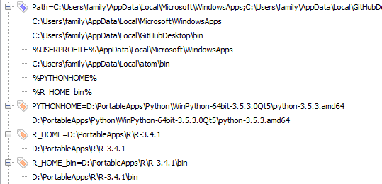

# Windows env Variable

* SET_ENV = D:\PortableApps\Scripts\set_env.cmd
  shortcut to be able to set custom env defined in shell scripts
* PATH (expandable string)
* R_HOME (string)
* R_HOME_bin (string)
* PYTHONHOME

Expand value mechanism allows to avoid set variable values several times (one level only)

